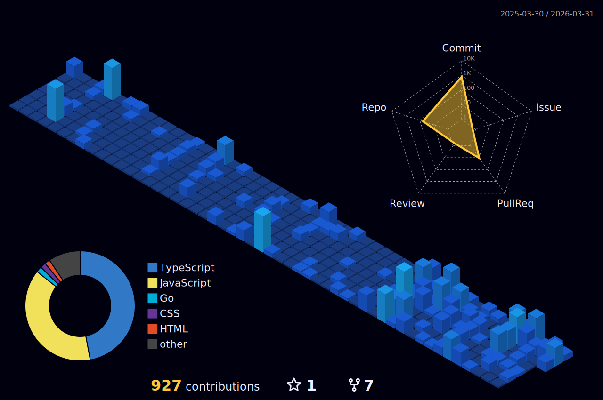

<div align="center">
  
```
                                           /$$         /$$       /$$                                             
                                          | $$         | $$      |__/                                            
  /$$$$$$   /$$$$$$   /$$$$$$   /$$$$$$  /$$$$$$       | $$$$$$$  /$$  /$$$$$$$ /$$  /$$  /$$  /$$$$$$   /$$$$$$$
 /$$__  $$ /$$__  $$ /$$__  $$ /$$__  $$|_  $$_/       | $$__  $$| $$ /$$_____/| $$ | $$ | $$ |____  $$ /$$_____/
| $$  \ $$| $$  \__/| $$$$$$$$| $$$$$$$$  | $$         | $$  \ $$| $$|  $$$$$$ | $$ | $$ | $$  /$$$$$$$|  $$$$$$  
| $$  | $$| $$      | $$_____/| $$_____/  | $$ /$$     | $$  | $$| $$ \____  $$| $$ | $$ | $$ /$$__  $$ \____  $$      
| $$$$$$$/| $$      |  $$$$$$$|  $$$$$$$  |  $$$$/     | $$$$$$$/| $$ /$$$$$$$/|  $$$$$/$$$$/|  $$$$$$$ /$$$$$$$/
| $$____/ |__/       \_______/ \_______/   \___/       |_______/ |__/|_______/  \_____/\___/  \_______/|_______/ 
| $$                                                                                                                          
| $$                                                                                                                          
|__/                                                                                                                          
```


</br>

[](https://git.io/typing-svg)

</div>

---
<div align="center">

# 🌌 **MY GITHUB GALAXY** 🌌



<br/><br/>

<table>
  <tr>
    <td>
      
    </td>
    <td>
      
    </td>
  </tr>
</table>

</div>


---

<div align="center">

# 📊 **TECH ARSENAL** 📊

### 🧠 Core Languages & Foundations


### ⚙️ Frontend & UI Engineering


### 🛠 Backend, APIs & Runtimes


### ☁️ Cloud, DevOps & CI/CD


### 🧰 Tools, IDEs & Platforms


### 🎨 Design, Animation & Video


### 🤖 AI, Hardware & Embedded


---

<div align="center">

# 🏆 **GITHUB TROPHIES CABINET** 🏆

[](https://github.com/lucthienphong1120/github-trophies.git)


</div>

---
<div align="center">

# 🎵 **Keep Vibing** 🎵
[](https://github.com/kittinan/spotify-github-profile)

</div>

---


<div align="center">

# 🌐 **Let's Connect** 🌐

<div align="center">

<a href="https://linkedin.com/in/preet-biswas" target="_blank">
  
</a>
&nbsp;&nbsp;
<a href="https://stackoverflow.com/users/30453579/preet-biswas" target="_blank">
  
</a>
&nbsp;&nbsp;
<a href="https://x.com/preetb2006" target="_blank">
  
</a>

</div>

---

<div align="center">


**Let's have a Coffee together! ☕**

[](https://www.buymeacoffee.com/preetbiswas12)


</div>

---


**Catch you on the flip side!**

</div>

---
